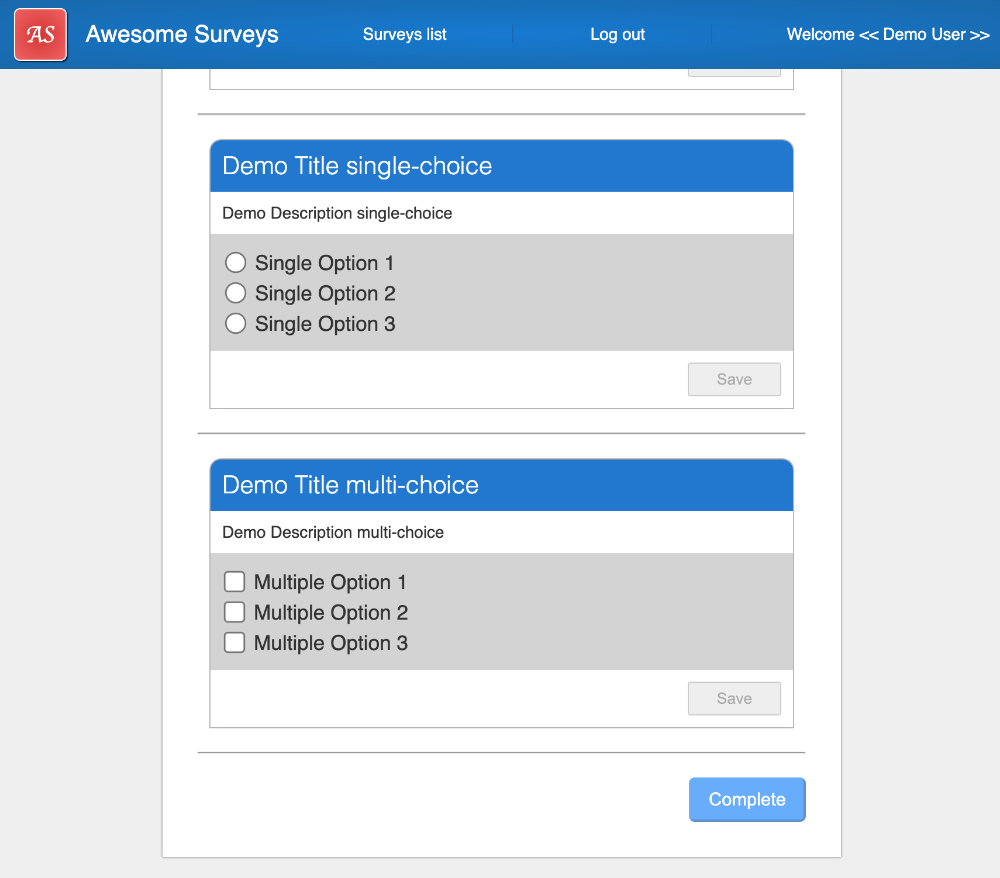

# Awesome Surveys

# Start up

run the command `npm start`

# Application structure

The application is composed by 3 modules.

# Folders

## _Core_

This folder contains the core entities of the application:

## _Model_

This folder contains:

    1. *Mock-State* and *Mock-Survey* used to mock the result of the WEB API which eventually will replace them when is ready

    2. Suvery. It contains all the interface type which represent the Survey

    3. User. It contains the User type interface which represents the user.

## _Services_

This folder contains:

    1. *SurveyService*. It contains the functions which mock the WEB API backed calls

    2. *AppSurveyStoreService*. It contains those functions needed to create and update the state of the application

## 1. Module _App_

This module is the main one, it is provided by the `ng` tool scaffolder and is the entry point of the application.
It works with the module AppRouting to provide the routing support for the application. It acts as container for any other module of the application

### Pages

*PageNotFound*. It is a minimal UI page used to redirect the user in case tries to make a request to a route which doesn't exist.

## 1.1 Module AppRouting

*AppRoutingModule*. It contains all the routes of the application, it lasys load the module _Survey_.

## 2. Module _Access_

This module contains:

### Pages

*Login*. which used to access to the application and will be the where the user is redirected if try to access to restricted pages. Once the login is performed the application will save the credential on the local storage to avoid to required the password everytime the user refresh the page.

### Services

*auth.service*. This service is in charge to perform *Login*, *Logout* and to check is a user is currently logged in.

# Application pages

The first page loaded is the login. To access to the list of surveys you can use any user name and password for this demo. It is important to login otherwise you won't access to the the other pages.

## 3. Module _Survey_

This module is lazy loaded, it contains all the page and services related the survey which the user will interact with. It's composed by:

1. Pages

   - SurveyForm
   - SuveyList
   - SurveySummary

2. Page Components and nested components

   - SurveyQuestion. This is the main component which represents the **Question** block and is composed alternatively by the following components:
     1. FreeTextQuestion
     2. MultiChoiceQuestion
     3. SingleChoiceQuestion
     4. YesNoQuestion

3. Service Guards

   - **AuthGuard**. This guard check if the user is logged in, if so allows the user to access to the survey module.
   - **SurveyGuard**. Check if the the user has completed the form, if so allows the user to access to the Summary.

### 1. Login

The `Log In` button will redirect the user to the dashboard page which shows the list of surveys.

### 2. Survey list

To access a survey click on any of the displayed cards.

### 3. Survey Form

The survey form displays a dynamic set of questions with their definition coming from a list of JSON files which mock the backend API. Each survey have different questions and the questions can be of the following types:

- Free text.
- Yes/No.
- Single selection.
- Multiple selection.

### 4. Workflow

1. A user is required to answer all question by typing or by click of the option buttons such Radio button or Checkbox.

2. Once the user provides an answer the `Save` button gets activated

3. A user is required to click on the `Save` button to store the answer provided

4. Once the answer is saved the question frame border will turn to a green colour to confirm that the answer has been stored

### Survey submission

Once all questions get an answer and once all of them are saved by clicking on the `Save` button, then the button `Complete` gets actvated and finally the user can submit the survey.

### Summary

Once the user click to the button `Complete` will get redirect to the summary page which shows all the questions the user answers

